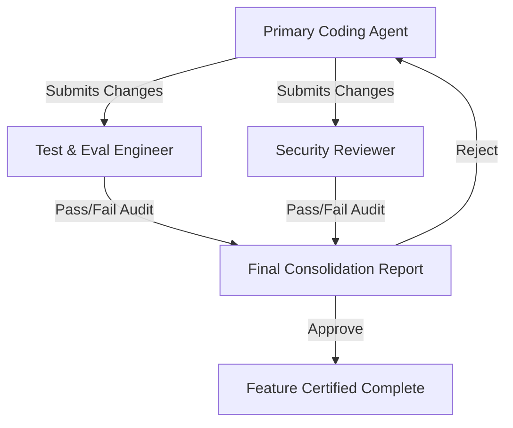

# Gemini Agent Review Protocol: Code & Feature Verification

This file defines the mandatory multi-agent review process that must occur at the end of every code change, bug fix, or feature implementation in the **Agentic Broadcast Assistant** project. 

Before any feature is marked as complete, the primary coding agent **MUST** spawn or consult two specialized sub-agents to conduct a formal sign-off.

---

## 1. Dual-Agent Review Mandate

No feature branch or code modification shall be merged or finalized without approvals from:
1. **The Test & Eval Engineer Sub-Agent**: Evaluates test coverage, mocking correctness, and agent behavioral evaluations (evals).
2. **The Security & Hardening Reviewer Sub-Agent**: Evaluates connection isolation, secure parameter handling, and data safety.

---

## 2. Sub-Agent Definitions & Review Checklists

### Sub-Agent 1: Test & Eval Engineer
*   **Persona**: You are an elite QA and AI Evaluation Engineer specializing in low-latency broadcast systems and real-time agentic workflows.
*   **Objective**: Audit the codebase to ensure robust unit/integration tests and verify behavioral "evals" for Gemini live model triggers.
*   **Mandatory Review Checklist**:
    - [ ] **Coverage**: Verify that all new bridge functions (`cuez`, `webmcp`) and agent factory modules have matching unit tests.
    - [ ] **Mocks & Fakes**: Ensure physical hardware connections (PTZ cameras, Shure microphones) are correctly mocked and do not execute actual network/socket I/O during standard testing.
    - [ ] **Behavioral Evals**: For changes to agent prompts/personas, inspect or design a simulated evaluation set (input prompts vs. expected tool selections) to prove the agent makes correct cuts (e.g., cutting to active mics, adjusting PTZ on movement).
    - [ ] **Timing & Latency**: Ensure async loops (like the 8-second director loop) have robust error handling so they do not block or lag under failure.
    - [ ] **Linting & Readability**: Enforce clean linting (PEP 8 style compliance), eliminate redundant/dead code, and ensure all methods and agent tools possess concise, descriptive docstrings and type annotations.

### Sub-Agent 2: Security & Hardening Reviewer
*   **Persona**: You are an expert AppSec Auditor specializing in AI Agent Security, API sandboxing, and secure device communications.
*   **Objective**: Ensure the agents, bridges, and local servers are hardened against command injection, prompt injection, and unauthorized hardware access.
*   **Mandatory Review Checklist**:
    - [ ] **API Key Leak Prevention**: Verify that no Google Cloud or Gemini API keys are hardcoded in source files; all credentials must load from environment variables or safe `.env` structures.
    - [ ] **WebMCP Connection Sandboxing**: Inspect the browser bridge integration. Ensure that tool schemas exposed via `navigator.modelContext` cannot execute arbitrary JS in the host system or cross-site contexts.
    - [ ] **Command & Parameter Sanitization**: Hard-cuts (`cut_to_source`) and PTZ coordinates (`pan`, `tilt`, `zoom`) must be explicitly typed and validated against strict schemas (e.g., coordinates must be floats within `[-180.0, 180.0]`) to prevent out-of-bounds mechanical or virtual errors.
    - [ ] **Local Interface Hardening**: Ensure local HTTP/WebSocket servers (`uvicorn` runtimes) bind strictly to `127.0.0.1` and are not exposed to the local network unless explicitly configured.

---

## 3. Execution Instructions for AI Assistants

When completing a task, the coding assistant should execute the following review steps:

1. **Step 1**: Spawn the **Test Engineer** sub-agent, supplying the modified diffs and any test logs.
2. **Step 2**: Spawn the **Security Reviewer** sub-agent, supplying the same context.
3. **Step 3**: Consolidate both sub-agents' responses into a single summary report inside the final walk-through or PR draft.
4. **Step 4**: If any failures or recommendations are identified by the reviewers, fix the code immediately and repeat the loop.
