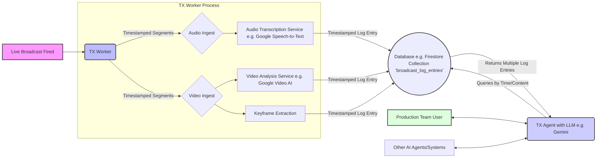

# AI TX Agent for Live Broadcast: Conceptual Overview

This document outlines a conceptual framework for an AI-powered Transmission (TX) Agent system designed to assist live broadcast production teams, particularly directors and editors, by providing real-time information about what has already occurred in the broadcast.

## Core Concept

The system comprises two main components:

1. **TX Worker (Content Logger):** This automated component continuously monitors the live broadcast feed, processes its content, and logs relevant information into a structured database. Each piece of information (e.g., a transcript snippet, a visual scene description) is stored with a precise timestamp from the original broadcast.
2. **TX Agent (Conversational Interface):** This AI agent allows production team members (and potentially other automated systems) to query the logged information using natural language. It retrieves relevant data based on time and content, then uses an LLM to synthesize answers.

## 1. TX Worker: Real-time Content Ingestion and Logging

The TX Worker is the backbone of the system, responsible for capturing and understanding the broadcast content as it happens. Its primary role is to ensure all analyzed data is accurately timestamped for later synchronization and retrieval.

**Responsibilities:**

* **Ingest Live Feed:** Securely tap into the live broadcast output (SDI, NDI, IP stream).
* **Timestamping:** Assign a precise UTC timestamp and broadcast timecode to every segment of data processed. This is crucial for synchronization.
* **Content Analysis (Multi-modal):**
  * **Audio Transcription:** Convert spoken words into text (e.g., using Google Cloud Speech-to-Text with Chirp for streaming and diarization). Results are logged with their corresponding timestamps.
  * **Video Scene/Content Description:** Identify key visual elements, scenes, actions, on-screen graphics (e.g., using Google Cloud Video AI with Gemini models). Results are logged with their corresponding timestamps.
  * **Video Frame Extraction:** Periodically save key video frames, linked by timestamp.
  * **Metadata Extraction:** Log timecodes, programme segment information, and any other available broadcast metadata, all associated with timestamps.
* **Data Structuring & Logging:** Organize the extracted information into distinct, timestamped log entries in the database. For instance, a transcript snippet and a visual scene description for the same moment would be separate entries sharing very close timestamps.

**Potential Technologies & Techniques:**

* **Audio Transcription:**
  * Google Cloud Speech-to-Text (especially models like Chirp).
  * Other cloud-based Speech-to-Text services.
  * Open-source models (e.g., Whisper).
* **Video Analysis:**
  * Google Cloud Video AI (leveraging Gemini models).
  * Other Cloud AI Video Intelligence Platforms.
  * Computer Vision Libraries (OpenCV, TensorFlow, PyTorch).
* **Frame Extraction:** FFmpeg.
* **Real-time Processing Pipelines:** Google Cloud Pub/Sub, Apache Kafka, etc.

**Example Log Entries in Firestore (Conceptual):**

These examples illustrate how different pieces of information about the *same broadcast moment* would be stored as separate, timestamped documents in a collection (e.g., `broadcast_log_entries`).

* **Audio Transcript Segment:**

    ```json
    {
      "doc_id": "audio_event_001",
      "timestamp_utc": "2025-05-13T10:15:32.500Z",
      "timecode": "01:15:32:12",
      "log_type": "audio_transcript_segment",
      "data": {
        "speaker_id": "Commentator_A",
        "transcript": "And that's a fantastic goal from Smith! What a strike from outside the box!"
      }
    }
    ```

* **Video Scene Description:**

    ```json
    {
      "doc_id": "video_event_001",
      "timestamp_utc": "2025-05-13T10:15:33.000Z",
      "timecode": "01:15:33:00",
      "log_type": "video_scene_description",
      "data": {
        "description": "Player #10 (Smith) scores a goal. Ball enters top left of net. Crowd celebrating.",
        "objects_detected": ["football", "goal_net", "player_smith", "crowd"],
        "keyframe_path": "/mnt/storage/frames/20250513/goal_smith_101532.jpg"
      }
    }
    ```

* **On-Screen Graphic Information:**

    ```json
    {
      "doc_id": "osg_event_001",
      "timestamp_utc": "2025-05-13T10:15:33.200Z",
      "timecode": "01:15:33:05",
      "log_type": "on_screen_graphic",
      "data": {
        "graphic_type": "score_update",
        "text_content": "Team A 1 - 0 Team B"
      }
    }
    ```

## 2. Database: Storing Broadcast Events

The choice of database is critical. It must support fast writes of individual log entries and efficient querying by timestamp and content.

**Considerations:**

* **Scalability, Query Performance, Data Types, Real-time Capabilities, Ease of Use & SDKs.**

**Potential Database Technologies:**

* **NoSQL Databases:**
  * **Google Cloud Firestore:** Highly recommended.
    * **Real-time Listeners:** Enables the TX Agent to be aware of new log entries instantly.
    * **Scalability & Performance:** Handles high-volume writes and fast, indexed queries (especially by `timestamp_utc`).
    * **User-friendly SDKs.**
    * Ideal for storing collections of individual, timestamped JSON log entries.
  * MongoDB, Elasticsearch (for advanced text search).
  * Redis (for caching).
* **Time-Series Databases:** InfluxDB, TimescaleDB.
* **Relational Databases with Extensions:** Google Cloud SQL for PostgreSQL.
* **Vector Databases:** Google Cloud Vertex AI Vector Search, Pinecone, Weaviate (for semantic search on embeddings).

## 3. TX Agent: Conversational Access to Broadcast History

The TX Agent uses an LLM (e.g., Gemini) with a Retrieval Augmented Generation (RAG) approach.

**Responsibilities:**

* **Natural Language Understanding (NLU):** Interpret user queries.
* **Query Formulation for Database:**
    1. Determine the relevant time window or key events from the user's query.
    2. Query the database (e.g., Firestore) for all relevant log entries (audio, video, graphics, etc.) within that time window or associated with those events, using timestamps as the primary linking mechanism.
* **Contextual Data Retrieval:** Gather the disparate log entries (e.g., a transcript, a scene description, an on-screen graphic text) that correspond to the same broadcast moment or period.
* **Information Synthesis & Presentation (via LLM):** Pass the retrieved, time-correlated data along with the original query to the LLM. The LLM then synthesizes this information into a coherent answer.
* **Context Management:** Handle follow-up questions.

**Potential Technologies & Techniques:**

* **Large Language Models (LLMs) (e.g., Google Gemini) using RAG.**
* **Frameworks for Conversational AI:** Google Dialogflow CX.

**Example Interaction Flow (Simplified):**

1. **Director:** "TX Agent, what did the commentator say when Smith scored that goal around 01:15?"
2. **TX Agent:**
    * Identifies "Smith," "goal," and time "01:15" as key entities.
    * Queries Firestore for `log_type: "video_scene_description"` containing "Smith" and "goal" around `timecode: "01:15:xx:xx"`. Finds `video_event_001` at `timecode: "01:15:33:00"`.
    * Queries Firestore for `log_type: "audio_transcript_segment"` with `timecode` very close to `01:15:33:00`. Finds `audio_event_001`.
    * Queries for other relevant logs like `on_screen_graphic` around the same time. Finds `osg_event_001`.
    * Provides the LLM with the question and the content of `audio_event_001`, `video_event_001`, and `osg_event_001`.
3. **LLM (via TX Agent):** "At 01:15:33, when Smith scored the goal (described as 'Player #10 (Smith) scores a goal. Ball enters top left of net. Crowd celebrating.'), Commentator A said: 'And that's a fantastic goal from Smith! What a strike from outside the box!'. The score graphic showed 'Team A 1 - 0 Team B'."

## 4. Overall System Architecture (Simplified)



**Flow:**

1. The **Live Broadcast Feed** is fed into the **TX Worker**.
2. The TX Worker processes segments, assigning **precise timestamps**, and sends them to analysis services.
3. Each piece of analyzed information (transcript, video description, etc.) is logged as a **separate, timestamped entry** in the **Database** (e.g., Firestore).
4. The **Production Team User** interacts with the **TX Agent**.
5. The TX Agent queries the **Database** for multiple relevant log entries based on time and content, then uses the LLM to synthesize an answer from this retrieved context.

## 5. Key Considerations & Challenges

* **Real-time Performance, Accuracy, Scalability, Cost, Data Management & Retention, Specificity vs. Generality, UI/UX, Integration, Error Handling.**

## Next Steps & Potential Enhancements

* **Speaker Diarization, Sentiment Analysis, Automated Highlight Generation, Cross-referencing with Schedules, Visual Search.**

This conceptual framework provides a starting point. The specific implementation details would depend heavily on the exact requirements of the broadcast environment, available budget, and technical expertise.
